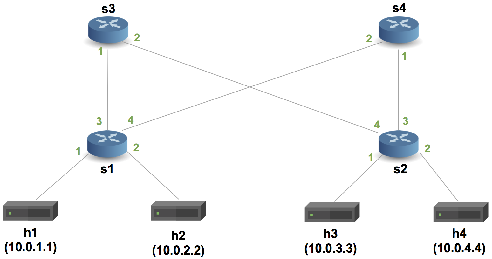

# Implementing Basic Forwarding

## Introduction

The objective of this exercise is to write a P4 program that
implements basic forwarding. To keep things simple, we will just
implement forwarding for IPv4.

With IPv4 forwarding, the switch must perform the following actions
for every packet: (i) update the source and destination MAC addresses,
(ii) decrement the time-to-live (TTL) in the IP header, and (iii)
forward the packet out the appropriate port.
 
Your switch will have a single table, which the control plane will
populate with static rules. Each rule will map an IP address to the
MAC address and output port for the next hop. We have already defined
the control plane rules, so you only need to implement the data plane
logic of your P4 program.

We will use the following topology for this exercise. It is a single
pod of a fat-tree topology and henceforth referred to as pod-topo:


Our P4 program will be written for the V1Model architecture implemented
on P4.org's bmv2 software switch. The architecture file for the V1Model
can be found at: /usr/local/share/p4c/p4include/v1model.p4. This file
desribes the interfaces of the P4 programmable elements in the architecture,
the supported externs, as well as the architecture's standard metadata
fields. We encourage you to take a look at it.

> **Spoiler alert:** There is a reference solution in the `solution`
> sub-directory. Feel free to compare your implementation to the
> reference.

## Step 1: Run the (incomplete) starter code

The directory with this README also contains a skeleton P4 program,
`basic.p4`, which initially drops all packets. Your job will be to
extend this skeleton program to properly forward IPv4 packets.

Before that, let's compile the incomplete `basic.p4` and bring
up a switch in Mininet to test its behavior.

1. In your shell, run:
   ```bash
   make run
   ```
   This will:
   * compile `basic.p4`, and
   * start the pod-topo in Mininet and configure all switches with
   the appropriate P4 program + table entries, and
   * configure all hosts with the commands listed in
   [pod-topo/topology.json](./pod-topo/topology.json)

2. You should now see a Mininet command prompt. Try to ping between
   hosts in the topology:
   ```bash
   mininet> h1 ping h2
   mininet> pingall
   ```
3. Type `exit` to leave each xterm and the Mininet command line.
   Then, to stop mininet:
   ```bash
   make stop
   ```
   And to delete all pcaps, build files, and logs:
   ```bash
   make clean
   ```

The ping failed because each switch is programmed
according to `basic.p4`, which drops all packets on arrival.
Your job is to extend this file so it forwards packets.

### A note about the control plane

A P4 program defines a packet-processing pipeline, but the rules
within each table are inserted by the control plane. When a rule
matches a packet, its action is invoked with parameters supplied by
the control plane as part of the rule.

In this exercise, we have already implemented the control plane
logic for you. As part of bringing up the Mininet instance, the
`make run` command will install packet-processing rules in the tables of
each switch. These are defined in the `sX-runtime.json` files, where
`X` corresponds to the switch number.

**Important:** We use P4Runtime to install the control plane rules. The
content of files `sX-runtime.json` refer to specific names of tables, keys, and
actions, as defined in the P4Info file produced by the compiler (look for the
file `build/basic.p4.p4info.txt` after executing `make run`). Any changes in the P4
program that add or rename tables, keys, or actions will need to be reflected in
these `sX-runtime.json` files.

## Step 2: Implement L3 forwarding

The `basic.p4` file contains a skeleton P4 program with key pieces of
logic replaced by `TODO` comments. Your implementation should follow
the structure given in this file---replace each `TODO` with logic
implementing the missing piece.

A complete `basic.p4` will contain the following components:

1. Header type definitions for Ethernet (`ethernet_t`) and IPv4 (`ipv4_t`).
2. **TODO:** Parsers for Ethernet and IPv4 that populate `ethernet_t` and `ipv4_t` fields.
3. An action to drop a packet, using `mark_to_drop()`.
4. **TODO:** An action (called `ipv4_forward`) that:
	1. Sets the egress port for the next hop. 
	2. Updates the ethernet destination address with the address of the next hop. 
	3. Updates the ethernet source address with the address of the switch. 
	4. Decrements the TTL.
5. **TODO:** A control that:
    1. Defines a table that will read an IPv4 destination address, and
       invoke either `drop` or `ipv4_forward`.
    2. An `apply` block that applies the table.   
6. **TODO:** A deparser that selects the order
    in which fields inserted into the outgoing packet.
7. A `package` instantiation supplied with the parser, control, and deparser.
    > In general, a package also requires instances of checksum verification
    > and recomputation controls. These are not necessary for this tutorial
    > and are replaced with instantiations of empty controls.

## Step 3: Run your solution

Follow the instructions from Step 1. This time, you should be able to
sucessfully ping between any two hosts in the topology. 

### Food for thought

The "test suite" for your solution---sending pings between hosts in the
topology---is not very robust. What else should you test to be confident
that you implementation is correct?

> Although the Python `scapy` library is outside the scope of this tutorial,
> it can be used to generate packets for testing. The `send.py` file shows how
> to use it.

Other questions to consider:
 - How would you enhance your program to respond to ARP requests?
 - How would you enhance your program to support traceroute?
 - How would you enhance your program to support next hops?
 - Is this program enough to replace a router?  What's missing?

### Troubleshooting

There are several problems that might manifest as you develop your program:

1. `basic.p4` might fail to compile. In this case, `make run` will
report the error emitted from the compiler and halt.

2. `basic.p4` might compile but fail to support the control plane
rules in the `s1-runtime.json` through `s3-runtime.json` files that
`make run` tries to install using P4Runtime. In this case, `make run` will
report errors if control plane rules cannot be installed. Use these error
messages to fix your `basic.p4` implementation.

3. `basic.p4` might compile, and the control plane rules might be
installed, but the switch might not process packets in the desired
way. The `logs/sX.log` files contain detailed logs
that describing how each switch processes each packet. The output is
detailed and can help pinpoint logic errors in your implementation.

#### Cleaning up Mininet

In the latter two cases above, `make run` may leave a Mininet instance
running in the background. Use the following command to clean up
these instances:

```bash
make stop
```

